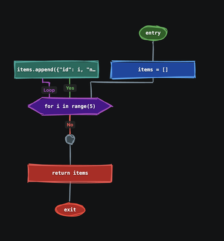

# CodeDetective

Instant flowcharts from your Python code. Right-click any function — CodeDetective parses it with tree-sitter, resolves calls across files via type inference, and renders an interactive control-flow diagram right inside VS Code.

---

  

---

## Features

- **One-click CFG** — right-click any Python function → "CodeDetective: Show code flow"
- **Hand-drawn aesthetic** — RoughJS sketchy style
- **Interactive** — pan, zoom, hover for tooltips, collapse/expand regions
- **Call resolution** — click a function call to see the callee's CFG
- **Type-aware** — resolves `self.attr.method()`, constructor calls, return type annotations
- **Edge labels** — "Yes"/"No" on branches, exception types on try/except edges
- **Cursor-driven** — place cursor on any call and trigger CFG to drill in
- **Module view** — trigger CFG at module level to see all functions/classes as drillable nodes

## Usage

1. Open a Python file
2. Right-click inside any function → **CodeDetective: Show code flow**
3. Or run from command palette (`Cmd+Shift+P`): **CodeDetective: Show code flow**

### Graph Controls

| Action | Control |
|--------|---------|
| Pan | Click and drag empty space |
| Zoom | Scroll wheel or +/- buttons |
| Fit | Click ⊡ button |
| Collapse/Expand | Double-click loop/if/for/while headers |
| Tooltip | Hover over any node |
| Reveal source | Click a node with source range |

## Requirements

- VS Code 1.90+
- Python files only

## What's Next

- **Entity-Relationship Diagrams (ERD)** — visualize domain models, dataclasses, and relationships between entities
- Light theme support
- Layout direction toggle
- More export formats (PNG, PDF)
- TypeScript/JavaScript support

---

[Changelog](CHANGELOG.md)

## License

MIT
