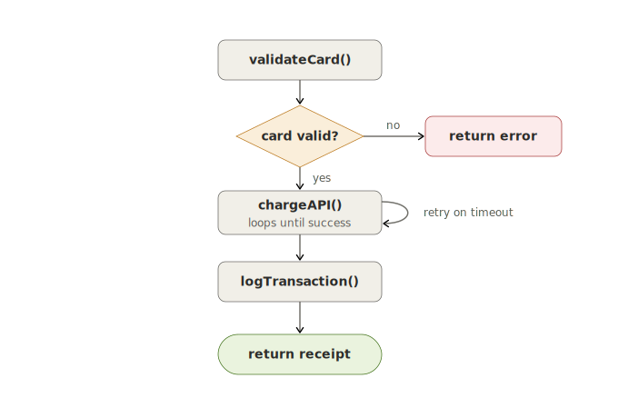
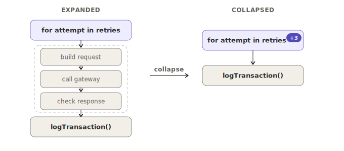
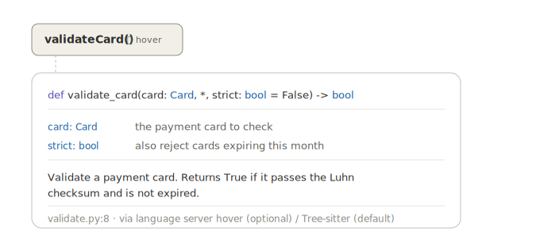

# Procedural CodeFlow — VS Code Extension Design

A VS Code extension that renders the **procedural control flow** of a selected function as
an interactive, collapsible graph. Select a function, see how it actually executes —
branches, loops, early returns, exception paths — laid out with GitHub-network-style curved
connectors, with the ability to fold any branch, loop body, or `try` block down to a single
node when the graph gets large.

**Language scope:** Python first. The architecture is multi-language by design (Tree-sitter
grammars are swappable), but the control-flow construction is partly language-shaped, so we
build and harden one language before adding more.

---

## 1. What it is, and the niche it fills

VS Code already ships **Call Hierarchy** (right-click a symbol → *Show Call Hierarchy*), but
that is a *tree in the sidebar* showing who-calls-what. It says nothing about what happens
*inside* a function when it runs.

This extension answers the other question: **"what is the execution path through this
function?"** That means an `if` is a fork that rejoins, a `for` is a loop with a back-edge, a
`return` jumps straight to the exit, and an exception takes a different path than the happy
case. That picture is a **control-flow graph (CFG)**, and almost no editor extension draws
one interactively. That gap is the product.



Two related views we are explicitly *not* leading with (see §12):
- **Hierarchical call tree** — what the function calls, recursively. Cheap (comes free from
  the call-hierarchy API) but already partially served by the built-in feature.
- **Network graph** (callers fan in, callees fan out). Useful, but secondary.

---

## 2. Design decisions

1. **Procedural-first.** The CFG view is the headline feature.
2. **Python-first.** One language, hardened, before expanding.
3. **Tree-sitter for parsing.** Do not write a parser. Tree-sitter has a maintained Python
   grammar, parses incrementally, and runs in-process via WASM.
4. **Collapse is load-bearing, not a nice-to-have.** A faithful CFG of a 200-line function is
   unreadable. Folding regions is what makes the view usable, so it is designed in from day
   one, not bolted on.
5. **Layout is delegated to ELK.** Hand-rolling graph layout is a project of its own. ELK's
   layered algorithm produces exactly the clean top-down flow we want.
6. **The editor is the source of truth.** Every node links back to its source range; clicking
   a node reveals it in the editor. The graph is a lens, not a separate document.
7. **Totally free, no backend, no lock-in.** The extension runs entirely in-process (extension
   host + webview), makes no network calls at runtime, requires no API key or account, and
   depends only on permissively licensed libraries. Crucially, it must **not require a
   proprietary language server** (see §9.3 and §15) — docs are extracted from the syntax tree
   we already have, so the extension works offline and on VS Code forks (VSCodium, etc.).

---

## 3. Build pipeline (overview)

```
 Selected symbol            cursor position in the active editor
        │
        ▼
 Locate function body       find the enclosing function_definition
        │                   (for Python: directly from the Tree-sitter tree —
        │                    no language server required)
        ▼
 Parse to syntax tree       web-tree-sitter + tree-sitter-python.wasm
        │
        ▼
 Build control-flow graph   recursive descent over statement nodes,
        │                   emitting CFG nodes + edges  ← the heart of the project
        ▼
 Lay out & render           elkjs computes coordinates → SVG in a webview,
                            bezier edges, click-to-reveal, collapse/expand
```

The first two stages reuse infrastructure. The CFG construction (stage 4) is the genuinely
new work and most of the engineering. Layout/render is mostly wiring well-known libraries.

---

## 4. Project structure

```
procedural-codeflow/
├── package.json                 # manifest: command, activation, contributes
├── tsconfig.json
├── esbuild.js                   # bundles extension + webview
├── media/
│   └── tree-sitter-python.wasm  # the Python grammar (see §6)
├── src/
│   ├── extension.ts             # activation, command, selection → function range
│   ├── parser.ts                # Tree-sitter loading + enclosing-function lookup
│   ├── cfg/
│   │   ├── model.ts             # CfgNode / CfgEdge / CfgRegion types
│   │   ├── builder.ts           # AST → CFG (the core)  ← Python-specific node names here
│   │   └── python-nodes.ts      # node-type/field-name constants for the grammar
│   └── panel.ts                 # webview lifecycle + message passing
└── webview/
    ├── main.ts                  # ELK layout + SVG render + collapse state
    └── style.css
```

---

## 5. VS Code integration layer

### 5.1 Manifest (`package.json`, the parts that matter)

```jsonc
{
  "name": "procedural-codeflow",
  "engines": { "vscode": "^1.90.0" },
  "activationEvents": [],
  "main": "./dist/extension.js",
  "contributes": {
    "commands": [
      {
        "command": "codeflow.showProcedural",
        "title": "CodeFlow: Show procedural flow for function at cursor"
      }
    ],
    "menus": {
      "editor/context": [
        {
          "command": "codeflow.showProcedural",
          "when": "editorLangId == python",
          "group": "navigation"
        }
      ]
    }
  }
}
```

Activation is lazy via the command — the extension does nothing until invoked.

### 5.2 Command + selection (`src/extension.ts`)

```ts
import * as vscode from 'vscode';
import { ensureParser, enclosingFunction } from './parser';
import { buildCfg } from './cfg/builder';
import { CodeFlowPanel } from './panel';

export async function activate(context: vscode.ExtensionContext) {
  context.subscriptions.push(
    vscode.commands.registerCommand('codeflow.showProcedural', async () => {
      const editor = vscode.window.activeTextEditor;
      if (!editor || editor.document.languageId !== 'python') {
        vscode.window.showInformationMessage('Place the cursor inside a Python function.');
        return;
      }

      const parser = await ensureParser(context);                  // §6
      const tree = parser.parse(editor.document.getText());
      const offset = editor.document.offsetAt(editor.selection.active);

      const fnNode = enclosingFunction(tree.rootNode, offset);     // §6
      if (!fnNode) {
        vscode.window.showInformationMessage('Cursor is not inside a function.');
        return;
      }

      const cfg = buildCfg(fnNode, editor.document);               // §7  ← the heart
      CodeFlowPanel.show(context, editor.document.uri, cfg);       // §9
    })
  );
}

export function deactivate() {}
```

Note the simplification: because we already have a Tree-sitter tree, we can find the enclosing
function directly from the cursor offset — no `executeDocumentSymbolProvider`, no dependency
on the Python language server. The "Locate function body" stage collapses into the parse
stage for Python.

---

## 6. Parsing with Tree-sitter (`src/parser.ts`)

We use `web-tree-sitter` (the WASM build) so there's no native compilation per platform.

**Getting the grammar:** ship `tree-sitter-python.wasm` in `media/`. You can obtain it from
the `tree-sitter-wasms` npm package, or build it with the Tree-sitter CLI
(`tree-sitter build --wasm` against `tree-sitter-python`). Pin the grammar version and record
it — node-type and field names can change between grammar releases (see the caveat in §7).

```ts
import * as vscode from 'vscode';
import Parser from 'web-tree-sitter';

let parserPromise: Promise<Parser> | undefined;

export function ensureParser(ctx: vscode.ExtensionContext): Promise<Parser> {
  if (!parserPromise) {
    parserPromise = (async () => {
      await Parser.init();
      const parser = new Parser();
      const wasmPath = vscode.Uri.joinPath(ctx.extensionUri, 'media', 'tree-sitter-python.wasm');
      const Python = await Parser.Language.load(wasmPath.fsPath);
      parser.setLanguage(Python);
      return parser;
    })();
  }
  return parserPromise;
}

// Walk down from the root to the smallest function_definition that contains `offset`.
export function enclosingFunction(root: Parser.SyntaxNode, offset: number): Parser.SyntaxNode | null {
  let node: Parser.SyntaxNode | null = root.descendantForIndex(offset);
  while (node) {
    if (node.type === 'function_definition') return node;
    node = node.parent;
  }
  return null;
}
```

For very large files, switch to incremental parsing (`tree.edit(...)` + re-parse with the old
tree) so re-renders after edits are cheap. Not needed for the MVP.

---

## 7. The core: AST → Control-Flow Graph (`src/cfg/builder.ts`)

This is the heart of the extension. A syntax tree gives you the *shape* of the code; a CFG
gives you the *execution paths*. You build it by walking statement nodes and emitting graph
nodes and edges.

### 7.1 The graph model (`src/cfg/model.ts`)

```ts
export type CfgNodeKind =
  | 'entry' | 'exit'        // function boundaries
  | 'statement'             // straight-line step (assignment, call, expression)
  | 'branch'                // if / elif / match — a fork
  | 'loop'                  // for / while header
  | 'merge'                 // where branches rejoin
  | 'return' | 'raise';     // flow-terminating

export interface CfgNode {
  id: string;
  kind: CfgNodeKind;
  label: string;            // short text shown in the box
  range?: SrcRange;         // for click-to-reveal in the editor
  regionId?: string;        // which collapsible region this node belongs to
}

export type EdgeKind = 'normal' | 'true' | 'false' | 'loop-back' | 'exception' | 'case';

export interface CfgEdge {
  from: string;
  to: string;
  kind: EdgeKind;
  label?: string;           // e.g. "yes" / "no" / "retry"
}

// A foldable region: an if-block, a loop body, a try-block, etc.
export interface CfgRegion {
  id: string;
  kind: 'if' | 'for' | 'while' | 'try' | 'with' | 'match';
  headerId: string;         // the node shown when the region is collapsed
  memberIds: string[];      // everything hidden when collapsed
  exitIds: string[];        // edges that leave the region (re-attached on collapse)
}

export interface Cfg {
  nodes: CfgNode[];
  edges: CfgEdge[];
  regions: CfgRegion[];
  entryId: string;
  exitId: string;
}
```

### 7.2 The algorithm

The clean way to handle sequencing, merging branches, and dead flow after a `return` is the
**predecessor-frontier** pattern. Every statement-processing function:

- takes a list of *predecessor node ids* (whose out-edges should connect into this statement),
- creates whatever nodes/edges it needs,
- returns the *frontier*: the node ids that are "live" after it (the predecessors for the next
  statement).

A `return`/`raise` returns an **empty frontier** — nothing flows after it, which is exactly
how dead code falls out naturally. Branches return the **union** of their arms' frontiers.

`break`/`continue` and `return`/`raise` need targets that aren't the next statement, so the
builder carries a small context: a stack of loop targets and the function exit node.

```ts
import Parser from 'web-tree-sitter';
import { Cfg, CfgNode, CfgEdge, CfgRegion } from './model';
import * as N from './python-nodes';   // node-type / field-name constants

interface LoopCtx { continueTo: string; breakTo: string; }

class Builder {
  nodes: CfgNode[] = [];
  edges: CfgEdge[] = [];
  regions: CfgRegion[] = [];
  private seq = 0;
  private loops: LoopCtx[] = [];
  readonly exitId = 'exit';

  constructor(private doc: TextDocLike) {
    this.add({ id: 'entry', kind: 'entry', label: 'entry' });
    this.add({ id: this.exitId, kind: 'exit', label: 'exit' });
  }

  private id() { return `n${this.seq++}`; }
  private add(n: CfgNode) { this.nodes.push(n); return n.id; }
  private link(from: string[], to: string, kind: CfgEdge['kind'] = 'normal', label?: string) {
    for (const f of from) this.edges.push({ from: f, to, kind, label });
  }

  /** Process a `block` (list of statements). Returns the live frontier. */
  block(block: Parser.SyntaxNode, preds: string[]): string[] {
    let frontier = preds;
    for (const stmt of block.namedChildren) {
      frontier = this.statement(stmt, frontier);
      if (frontier.length === 0) break;   // dead code after return/raise/break/continue
    }
    return frontier;
  }

  statement(node: Parser.SyntaxNode, preds: string[]): string[] {
    switch (node.type) {
      case N.IF:        return this.ifStmt(node, preds);
      case N.FOR:       return this.forStmt(node, preds);
      case N.WHILE:     return this.whileStmt(node, preds);
      case N.RETURN:    return this.terminator(node, preds, 'return');
      case N.RAISE:     return this.terminator(node, preds, 'raise');
      case N.BREAK:     this.link(preds, this.loops.at(-1)!.breakTo);    return [];
      case N.CONTINUE:  this.link(preds, this.loops.at(-1)!.continueTo); return [];
      case N.TRY:       return this.tryStmt(node, preds);
      case N.WITH:      return this.block(node.childForFieldName('body')!, preds);
      case N.MATCH:     return this.matchStmt(node, preds);
      // function_definition / class_definition nested inside: treat as one opaque
      // statement (it's a *definition*, not executed inline). Clicking it later can
      // open its own CFG.
      default: {
        const id = this.add({ id: this.id(), kind: 'statement', label: this.text(node), range: this.range(node) });
        this.link(preds, id);
        return [id];
      }
    }
  }

  private ifStmt(node: Parser.SyntaxNode, preds: string[]): string[] {
    const cond = this.add({ id: this.id(), kind: 'branch', label: this.text(node.childForFieldName('condition')!), range: this.range(node) });
    this.link(preds, cond);

    const trueFrontier = this.block(node.childForFieldName('consequence')!, [cond]);   // edge kind 'true' applied below
    // (tag the cond→firstTrueNode edge as 'true'; tag the false edge as 'false')

    // The `alternative` is a sequence of elif_clause / else_clause nodes.
    let falsePreds = [cond];
    let elseFrontier: string[] = [];
    let sawElse = false;
    for (const alt of node.childrenForFieldName('alternative')) {
      if (alt.type === N.ELIF) {
        const c = this.add({ id: this.id(), kind: 'branch', label: this.text(alt.childForFieldName('condition')!), range: this.range(alt) });
        this.link(falsePreds, c, 'false');
        elseFrontier.push(...this.block(alt.childForFieldName('consequence')!, [c]));
        falsePreds = [c];                 // next elif/else is the false side of this one
      } else if (alt.type === N.ELSE) {
        sawElse = true;
        elseFrontier.push(...this.block(alt.childForFieldName('body')!, falsePreds));
      }
    }
    const falseExit = sawElse ? elseFrontier : [...falsePreds, ...elseFrontier];
    return [...trueFrontier, ...falseExit];   // both arms rejoin here
  }

  private forStmt(node: Parser.SyntaxNode, preds: string[]): string[] {
    const header = this.add({
      id: this.id(), kind: 'loop',
      label: `for ${this.text(node.childForFieldName('left')!)} in ${this.text(node.childForFieldName('right')!)}`,
      range: this.range(node),
    });
    this.link(preds, header);

    // After the loop finishes normally, Python runs an optional `else` clause,
    // UNLESS the loop was exited via `break`. This for/while-else behaviour is a
    // genuine Python subtlety the CFG must model.
    const afterId = this.add({ id: this.id(), kind: 'merge', label: '' });
    this.loops.push({ continueTo: header, breakTo: afterId });

    const bodyFrontier = this.block(node.childForFieldName('body')!, [header]); // header→body = 'true'/iterate
    this.link(bodyFrontier, header, 'loop-back');   // end of body → back to header

    this.loops.pop();

    const elseClause = node.childForFieldName('alternative');   // for-else
    if (elseClause) {
      const elseFrontier = this.block(elseClause.childForFieldName('body')!, [header]); // header(exhausted)→else
      this.link(elseFrontier, afterId);
    } else {
      this.link([header], afterId, 'false');        // exhausted → after
    }
    return [afterId];
  }

  private whileStmt(node: Parser.SyntaxNode, preds: string[]): string[] {
    // Same structure as forStmt: a condition loop node, a loop-back edge, optional else.
    // (Omitted here for brevity — mirror forStmt with a condition label.)
    return preds; /* see repo */
  }

  private terminator(node: Parser.SyntaxNode, preds: string[], kind: 'return' | 'raise'): string[] {
    const id = this.add({ id: this.id(), kind, label: this.text(node), range: this.range(node) });
    this.link(preds, id);
    this.link([id], this.exitId);     // raise inside a try should target the handler — see §10 gotchas
    return [];                         // dead flow
  }

  private tryStmt(node: Parser.SyntaxNode, preds: string[]): string[] {
    // MVP model (documented simplification):
    //   try-body runs; each except handler is reachable via an 'exception' edge from
    //   the try body; `else` runs on the no-exception path; `finally` runs on every path.
    // Full fidelity (every statement in the body can raise into every matching handler)
    // is future work — see §10.
    const body = node.childForFieldName('body')!;
    const bodyFrontier = this.block(body, preds);

    const handlerFrontiers: string[] = [];
    for (const ex of node.childrenForFieldName('handler') /* except_clause */) {
      const h = this.add({ id: this.id(), kind: 'statement', label: this.text(ex.firstNamedChild!), range: this.range(ex) });
      this.link([body.firstNamedChild ? bodyFrontier[0] ?? preds[0] : preds[0]], h, 'exception');
      handlerFrontiers.push(...this.block(ex.childForFieldName('consequence') ?? ex, [h]));
    }
    // else / finally handling omitted for brevity — see repo.
    return [...bodyFrontier, ...handlerFrontiers];
  }

  private matchStmt(node: Parser.SyntaxNode, preds: string[]): string[] {
    const subj = this.add({ id: this.id(), kind: 'branch', label: `match ${this.text(node.childForFieldName('subject')!)}`, range: this.range(node) });
    this.link(preds, subj);
    const out: string[] = [];
    for (const c of node.namedChildren.filter(n => n.type === N.CASE)) {
      out.push(...this.block(c, [subj]));   // subj→case = 'case'
    }
    return out;
  }

  // --- helpers ---
  private text(n: Parser.SyntaxNode): string { /* one-line, truncated source of n */ return ''; }
  private range(n: Parser.SyntaxNode) { /* {startLine,startCol,endLine,endCol} */ return undefined; }
}

export function buildCfg(fn: Parser.SyntaxNode, doc: TextDocLike): Cfg {
  const b = new Builder(doc);
  const body = fn.childForFieldName('body')!;
  const frontier = b.block(body, ['entry']);
  b.link(frontier, b.exitId);   // fall off the end → exit (implicit return None in Python)
  return { nodes: b.nodes, edges: b.edges, regions: b.regions, entryId: 'entry', exitId: b.exitId };
}
```

### 7.3 Python constructs and how each maps to the graph

| Construct                | CFG shape |
|--------------------------|-----------|
| sequence of statements   | chain of `statement` nodes |
| `if` / `elif` / `else`   | `branch` node, true/false edges, arms rejoin at a merge |
| `for` / `while`          | `loop` header, body, `loop-back` edge, exhausted edge |
| `for...else` / `while...else` | the `else` runs on the *exhausted* path, **not** the `break` path |
| `return`                 | `return` node → `exit`; kills the frontier |
| `raise`                  | `raise` node → handler (if in `try`) or `exit` |
| `break`                  | edge to the loop's break target; kills frontier |
| `continue`               | edge to the loop header; kills frontier |
| `pass`                   | a no-op `statement` node (keep it; it's a real line) |
| `try`/`except`/`else`/`finally` | body, `exception` edges to handlers, `finally` on all paths |
| `with`                   | MVP: body inline; later: enter/exit context nodes |
| `match`/`case` (3.10+)   | multi-way `branch`, one `case` edge per arm |
| nested `def`/`class`     | a single opaque node (definition, not inline execution) |

> **Caveat to verify before coding:** exact node-type strings and field names
> (`consequence`, `alternative`, `handler`, etc.) depend on the `tree-sitter-python`
> grammar *version*. Generate `python-nodes.ts` from the grammar's `node-types.json` and pin
> the version. Don't trust the names above blindly — confirm them against your build.

---

## 8. Layout with ELK

ELK (`elkjs`) runs in the webview and computes node coordinates and edge routes. Feed it the
CFG; it returns positions. Use the layered algorithm (top-to-bottom) — that's the natural
shape for control flow.

```ts
import ELK from 'elkjs/lib/elk.bundled.js';
const elk = new ELK();

async function layout(cfg: Cfg) {
  const graph = {
    id: 'root',
    layoutOptions: {
      'elk.algorithm': 'layered',
      'elk.direction': 'DOWN',
      'elk.layered.spacing.nodeNodeBetweenLayers': '48',
      'elk.spacing.nodeNode': '32',
    },
    children: cfg.nodes.map(n => ({ id: n.id, width: measure(n).w, height: measure(n).h })),
    edges: cfg.edges.map((e, i) => ({ id: `e${i}`, sources: [e.from], targets: [e.to] })),
  };
  return elk.layout(graph);   // → children with x/y, edges with bend points
}
```

`loop-back` edges become back-edges in the layered graph; ELK routes them around the side,
which reads exactly like a loop. Recompute layout whenever the collapse state changes (§9.2).

---

## 9. Rendering & interaction (webview)

### 9.1 Drawing

Render each laid-out node as an SVG `<rect>` (color by `kind`: branch = amber, return = ...,
etc., matching the style we prototyped) and each edge as a cubic bezier through ELK's bend
points — that gives the GitHub-network curved-connector look. Edge labels (`yes`/`no`/`retry`)
sit at the midpoint.

Two-way message passing with the extension host:

```
webview → host : { type: 'reveal', range }     // user clicked a node
host    → webview : { type: 'cfg', cfg }        // initial / refreshed graph
```

Clicking a node posts `reveal`; the host calls `vscode.window.showTextDocument` and selects
the node's `range`, so the graph and the editor stay in lockstep.

### 9.2 Collapse / expand (the load-bearing feature)

State lives in the webview: a `Set<string>` of collapsed region ids. Each structured
statement (`if`, `for`, `while`, `try`, `with`, `match`) produced a `CfgRegion` in §7.1 with a
`headerId`, its `memberIds`, and `exitIds`.

To render with region `R` collapsed:
1. Hide every node in `R.memberIds`.
2. Keep `R.headerId`, and stamp it with a badge: `+{memberIds.length}`.
3. Reroute: any edge that pointed *into* a hidden member now points at the header; any edge
   that left the region (`exitIds`) now originates from the header.
4. Re-run ELK layout on the reduced graph and redraw.

A small chevron/▸ on each region header toggles membership in the collapsed set. This is the
direct realization of the original "minimize/maximize objects when they're too long" idea —
fold an entire loop body or `except` block to one node, expand on demand. For deeply nested
functions, default to collapsing everything below depth *N* and let the user drill in.



### 9.3 Node hover — docs on demand

Hovering (or tapping, on touch) a node reveals a tooltip with the relevant signature,
parameter definitions, and docstring. There are **two kinds of node, with two sources** — and
both default sources are free and dependency-free.



**Header node (the selected function itself).** You want *its own* signature, params, and
docstring. You already have its `function_definition` node from Tree-sitter, so read them
straight off the tree: the `parameters` field gives the signature, and Python's docstring is
the first statement in the body if that statement is a string literal. No language server
involved.

```ts
export function functionDocs(fn: Parser.SyntaxNode, src: string) {
  const params = fn.childForFieldName('parameters')!;
  const name = fn.childForFieldName('name')!.text;
  const ret = fn.childForFieldName('return_type');               // optional `-> T`
  const signature = `${name}${params.text}${ret ? ' -> ' + ret.text : ''}`;

  // Docstring = first statement, if it is a bare string literal.
  const body = fn.childForFieldName('body');
  const first = body?.firstNamedChild;
  let docstring: string | undefined;
  if (first?.type === 'expression_statement' && first.firstNamedChild?.type === 'string') {
    docstring = stripPyQuotes(first.firstNamedChild.text);
  }
  return { signature, docstring, params: readParams(params) };   // params: name/type/default
}
```

**Call node (a call to a function defined elsewhere).** You want the *callee's* docs. Two
tiers, in order of preference:

1. **Free default — local resolution via Tree-sitter.** Maintain a lightweight workspace index
   (built by parsing files with the same grammar) mapping symbol name → its
   `function_definition`/`class_definition`. Resolve the call's name against it and run the
   same `functionDocs` extraction. This is free, offline, and works in any editor.
2. **Optional enrichment — whatever hover provider is installed.** If the user happens to have
   *any* hover provider active (the open-source Pyright, `python-lsp-server`/Jedi, or
   Microsoft's Pylance), `vscode.executeHoverProvider` returns richer, cross-file, type-aware
   docs — including for third-party libraries the local index won't have. Use it *if present*,
   never depend on it.

```ts
// Enrichment only — gracefully no-ops if no provider is installed.
async function lspHover(uri: vscode.Uri, pos: vscode.Position) {
  const hovers = await vscode.commands.executeCommand<vscode.Hover[]>(
    'vscode.executeHoverProvider', uri, pos);
  return hovers?.[0];   // may be undefined — fall back to the Tree-sitter index
}
```

> **Licensing note (this is why the tiers matter):** Pylance is proprietary and licensed for
> use only with official Microsoft VS Code. The extension must therefore never *require* it —
> the Tree-sitter path is the real feature, and any hover provider (Pylance included, if the
> user already has it) is a bonus layered on top. See §15.

**Async, never blocking.** Both the local index lookup and the hover-provider call are async.
Render the node label and open the tooltip shell immediately, then fill in signature/params/
docstring when they resolve. Layout never waits on docs.

**Webview tooltip.** Render the tooltip in normal flow or absolutely positioned *inside a
positioned container with reserved height* — not `position: fixed` (which misbehaves in the
webview). Reveal on `:hover`/`:focus-within`, and pin-on-click so it works on touch.

### 9.4 Live re-rendering on edit

The graph updates as you type, using Tree-sitter's incremental parsing. Listen to
`onDidChangeTextDocument`, apply each change to the existing tree, then re-parse passing the
old tree so unchanged subtrees are reused.

```ts
const DEBOUNCE_MS = 180;
let timer: ReturnType<typeof setTimeout> | undefined;

vscode.workspace.onDidChangeTextDocument(ev => {
  if (!current || ev.document.uri.toString() !== current.uri.toString()) return;

  // Apply edits to the tree immediately (cheap, keeps it in sync); debounce the rebuild.
  for (const c of ev.contentChanges) current.tree.edit(toTsEdit(c, ev.document));
  clearTimeout(timer);
  timer = setTimeout(() => rerender(ev.document), DEBOUNCE_MS);
});

function toTsEdit(c: vscode.TextDocumentContentChangeEvent, doc: vscode.TextDocument): Parser.Edit {
  const startIndex  = c.rangeOffset;
  const oldEndIndex = c.rangeOffset + c.rangeLength;
  const newEndIndex = c.rangeOffset + c.text.length;
  const pt = (p: vscode.Position) => ({ row: p.line, column: p.character });
  return {
    startIndex, oldEndIndex, newEndIndex,
    startPosition:  pt(doc.positionAt(startIndex)),
    oldEndPosition: pt(c.range.end),
    newEndPosition: pt(doc.positionAt(newEndIndex)),
  };
}

function rerender(doc: vscode.TextDocument) {
  current!.tree = parser.parse(doc.getText(), current!.tree);     // incremental re-parse
  const fn = findFunctionByKey(current!.tree.rootNode, current!.fnKey);
  if (!fn) { panel.postMessage({ type: 'gone' }); return; }       // displayed fn was deleted
  const cfg = buildCfg(fn, doc);
  panel.postMessage({ type: 'cfg', cfg, preserve: true });        // keep folds + viewport
}
```

Two requirements make this feel good instead of janky:

**1. Persist UI state across re-renders.** A naive rebuild regenerates node ids and resets
everything, so every keystroke would blow away the user's collapsed regions and scroll/zoom.
Avoid this by keying state on **stable structural identity**, not ephemeral ids:
- Track the *displayed function* by a stable `fnKey` — its qualified name plus nesting path
  (e.g. `PaymentService.process` or `outer.inner`), so it survives edits and re-parses.
- Key each `CfgRegion` by its structural path within the function (e.g. `if@2 > for@0`) rather
  than the generated node id. On rebuild, the webview reapplies the collapsed set to matching
  region keys and keeps its pan/zoom transform. (If you added the layout tween from the
  animation discussion, this is where it interpolates old node positions → new ones.)

**2. Tolerate invalid syntax.** While typing, code is constantly half-written. Tree-sitter
doesn't fail on this — it returns a tree containing `ERROR` nodes — so build a best-effort CFG
from whatever parsed. If the edited function's body is essentially all error (the new CFG is
empty or degenerate), **hold the last good render** and show a subtle "syntax incomplete"
indicator rather than flashing a broken graph. The debounce already rides over most transient
invalid states between keystrokes.

> **Offset-units caveat to test:** `rangeOffset`/`positionAt` and Tree-sitter point columns
> must agree on units. web-tree-sitter works in UTF-16 code units (matching JS strings), which
> lines up with VS Code's offsets — but multi-byte characters and emoji in source are exactly
> the case to write a test for, since an off-by-N there corrupts the incremental edit.

---

## 10. Gotchas & Python-specific edge cases

- **`for...else` / `while...else`.** The `else` runs when the loop finishes *without* `break`.
  Modeled in §7.2: the exhausted edge goes through `else`; `break` skips it.
- **`try`/`finally`.** `finally` runs on *every* exit path from the `try` — normal, exception,
  and even through a `return` inside the `try`. Faithful modeling means routing all of those
  through the `finally` node. The MVP simplifies; flag it in the UI as approximate until done.
- **Exceptions are pervasive.** Strictly, *any* statement can raise. Drawing an edge from
  every statement to every matching handler is correct but unreadable. Pragmatic choice: model
  one `exception` edge from the `try` body to each handler, and document it.
- **`return`/`raise` inside `try`.** Their target isn't the function exit directly — it's the
  enclosing `finally` (if any) first. Track a `finally` stack alongside the loop stack.
- **Generators (`yield`).** A function with `yield` is a generator; `yield` is a suspend/resume
  point. MVP: render `yield` as a normal `statement` node, but mark the function as a generator
  in the panel title.
- **`async`/`await`.** `async def` is structurally identical for control flow; `await` is a
  `statement` node. No special handling needed for the MVP.
- **Comprehensions & lambdas.** These contain implicit loops/branches but are *expressions*.
  Keep the containing statement as one node for the MVP; expanding them is future work.
- **Decorators.** Not part of the function's control flow — ignore for the CFG.
- **Match statements (3.10+).** Guards (`case X if cond:`) add a sub-condition; treat the whole
  case pattern+guard as the branch label for now.

---

## 11. Performance

- **Parse cost** is linear and fast; Tree-sitter is built for editor latency. Cache the tree
  per document and use incremental re-parse on edits if you add live updates.
- **Layout cost** dominates for big graphs. Mitigations: collapse-by-default below depth *N*
  (§9.2), and debounce re-layout on rapid expand/collapse.
- **Huge functions** are the real stress case — which is exactly why collapse is mandatory, not
  optional.

---

## 12. Roadmap

**Milestone 0 — Walking skeleton.** Command + webview that renders a fixed, hand-built CFG.
Proves the host↔webview↔ELK↔SVG pipeline end to end. No parsing yet.

**Milestone 1 — Straight-line + branches.** Tree-sitter wired up; CFG builder handles
sequences, `if`/`elif`/`else`, `return`, `raise`, `pass`. Click-to-reveal works.

**Milestone 2 — Loops.** `for`/`while`, `break`/`continue`, and `for...else`/`while...else`.
Loop-back edges route correctly through ELK.

**Milestone 3 — Collapse/expand.** Regions, header badges, reroute-on-collapse, collapse below
depth *N* by default. This is the milestone that makes it *usable*.

**Milestone 4 — Exceptions.** `try`/`except`/`else`/`finally` with the documented model;
`finally` stack for `return`/`raise` targets.

**Milestone 5 — Polish.** `match`/`case`, `with`, generator/async markers, theming to match the
editor, edge labels, minimap for large graphs.

**Milestone 6 — Live re-rendering on edit.** Incremental re-parse on `onDidChangeTextDocument`,
debounced; stable `fnKey` and region keys so folds and viewport survive edits; best-effort
rendering through `ERROR` nodes with a hold-last-good fallback. Depends on Milestone 3's region
identity work.

**Beyond — Multi-language.** Swap in another Tree-sitter grammar and a node-name map; the CFG
algorithm is reused, only the construct→graph mapping table changes per language. Optionally
add the secondary **hierarchical call-tree** view (cheap, from the call-hierarchy API) as a
toggle.

---

## 13. Dependencies

| Dependency             | Role | License |
|------------------------|------|---------|
| `web-tree-sitter`      | WASM parser runtime (in-process, no native build) | MIT |
| `tree-sitter-python.wasm` | the Python grammar (pin the version) | MIT |
| `elkjs`                | graph layout in the webview | EPL-2.0 |
| `esbuild`              | bundle extension host + webview (dev only) | MIT |
| VS Code API ≥ 1.90     | commands, webview panel, editor reveal | free |

Every runtime dependency is permissively licensed and ships *inside* the extension — nothing
is fetched at runtime. No proprietary dependency, no paid service (see §15).

---

## 14. Open decisions

1. **Granularity of `statement` nodes.** One node per statement, or merge consecutive
   straight-line statements into one "basic block" box? Basic blocks are denser and more
   standard for CFGs; per-statement is easier to click-map. *Leaning: basic blocks, with
   per-line ranges retained for reveal.*
2. **Default collapse depth.** What *N* keeps a typical function readable on first open?
3. **Exception fidelity.** Ship the simplified model first; decide later whether full
   per-statement exception edges are worth the visual cost.
4. **Live updates — decided: re-render on edit.** Incremental re-parse on every (debounced)
   edit rather than on-demand only. See §9.4 for the flow and its two requirements (stable
   identity for state persistence, tolerance of invalid syntax). The earliest milestones can
   stay on-demand; live re-render lands in Milestone 6 once region identity exists.

---

## 15. Totally free: cost, licensing, and offline guarantees

"Free" here means more than a $0 price tag — it means no cost, no backend, no account, and no
lock-in, by construction:

- **No runtime cost and no backend.** Everything runs in-process in the extension host and the
  webview. There is no server, no API key, no account, and no usage metering. There is nothing
  to bill because there is no service.
- **No network calls at runtime.** Parsing (Tree-sitter WASM), CFG construction, layout
  (elkjs), and doc extraction all run locally. The extension works fully **offline**, including
  on air-gapped machines.
- **No proprietary dependency.** This is the load-bearing constraint behind the §9.3 hover
  design. Pylance is proprietary and licensed only for official Microsoft VS Code, so the
  extension must never *require* it. Docs come from the Tree-sitter tree we already have; any
  installed hover provider (open-source Pyright, `python-lsp-server`/Jedi, or Pylance if the
  user already has it) is optional enrichment, never a requirement. As a result the extension
  also runs unmodified on **VS Code forks** — VSCodium, Cursor, Windsurf, Gitpod, etc.
- **Permissive licenses only.** See the §13 table — MIT throughout, plus EPL-2.0 for elkjs.
  No copyleft obligations are imposed on the user's code; everything ships bundled in the VSIX.
- **Published free, everywhere.** Publish on the VS Code Marketplace *and* on **Open VSX** —
  the latter is what the forks pull from, so listing there is what makes "works on forks"
  real rather than theoretical. Both are free to publish to.
- **No telemetry by default.** Ship with no analytics. If any diagnostics are ever added, make
  them strictly opt-in and respect `telemetry.telemetryLevel`.
- **Open source.** Releasing under a permissive license (MIT) keeps it free to use, fork, and
  contribute to, and is consistent with the dependency stack above.

The one practical asterisk: enrichment quality scales with what the user already has
installed. With no language server, hover docs cover the workspace's own symbols (via the
local Tree-sitter index); with a language server present, they additionally cover typed and
third-party symbols. Either way the extension itself adds no cost and no required dependency.
